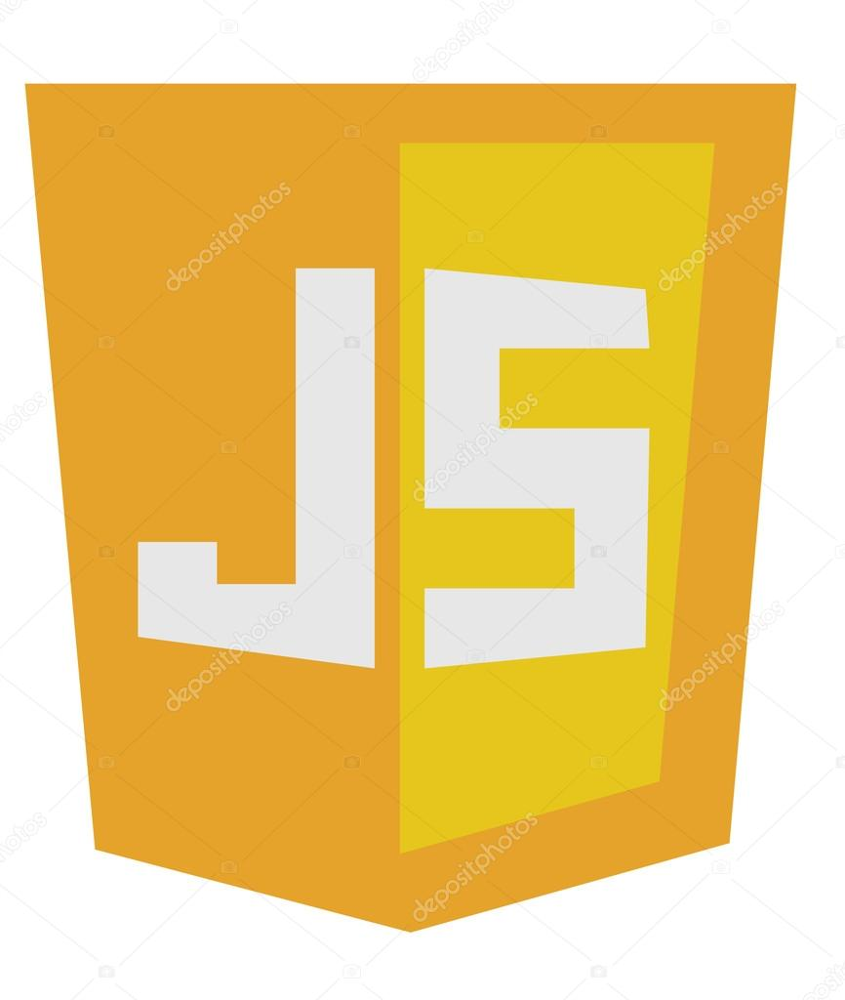

# Frontend_MERN

### Sobre el proyecto
Es el sexto proyecto que realizamos en [GeekHubs Academy](https://geekshubsacademy.com/), consiste en la realización de un Frontend para una red social, utilizando REACT y Redux, basado en el siguiente [Backend](https://github.com/XNycX/Backend_MERN/tree/develop).

## Pre-requisitos 📋

Necesitaremos la instalación de un programa específico para visualizar nuestro código de manera local, en este proyecto se ha utilizado [Visual studio code](https://code.visualstudio.com/Download/). 

### Tecnologías utilizadas 🚀

El proyecto ha sido desarrollado utilizando as siguientes tecnologias y herramientas:

 

 

 

## ¿Como desplegar el proyecto? 📋
Estas instrucciones te permitirán obtener una copia del proyecto en funcionamiento en tu máquina local para propósitos de desarrollo:

Clonarte el repositorio localmente:

> git clone url del repositorio
  
Instalar las depedencias necesarias:
  
> npm i  
  
😊 Genial ya tenemos todo listo para poder poner en marcha nuestra app 😊

###`npm start`

## Endpoints 🛠️

El sistema puede realizar las siguientes acciones:

- CRUD Posts
- CRUD Users
- Encriptación de ciertos campos mediante Bcryptjs
- Proceso de autenticación mediante jsonwebtoken
- Login al realizar confirmación de email

Para ver mas detalladamente el funcionamiento de cada endpoints consultar el siguiente enlace:

## Autores ✒️

* **Cristian Santamaria**
* **Raquel Moya**
* **Aída Ródenas**